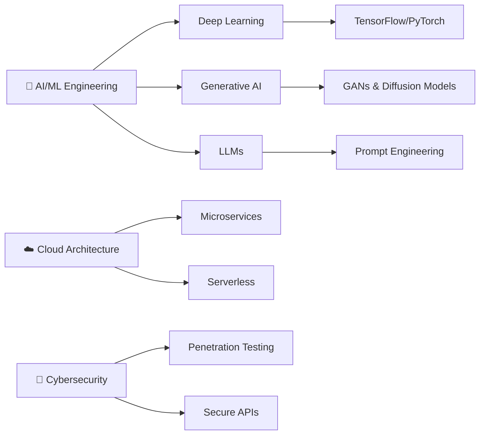

  

---

## 🚀 About Me

<table>
<tr>
<td width="50%">

### 👨‍💻 Professional Profile

- 🎯 **Role:** Back-End Engineer @ Turpin
- 📍 **Location:** Patna, Bihar, India 🇮🇳
- 🎓 **Education:** B.Sc. (Hons) CS - BITS Pilani (2026)
- 💼 **Experience:** 3+ years in Full-Stack Development
- ⭐ **Rating:** 5.0/5.0 on Freelance Projects

### 🌱 Currently Learning

- 🤖 Machine Learning & Deep Learning
- 🧠 Generative AI & Large Language Models
- 🔐 Advanced Cybersecurity
- ☁️ Cloud Architecture & Microservices

</td>
<td width="50%">

### 🏆 Key Achievements

- ✅ **10+ Client Projects** with perfect ratings
- 💰 **10K+ Monthly Transactions** handled
- 🚀 **0% Downtime** in production systems
- 🌟 **Active Hacktoberfest** Contributor
- 📊 **50+ ML Model** evaluations completed

### 💞️ Open For Collaboration

- Open Source Projects
- AI/ML Applications
- Full-Stack Development
- Cybersecurity Tools

</td>
</tr>
</table>

**💡 Fun Fact:** *I turn coffee ☕ into code and bugs into features!* 🐛✨

---

## 💼 Professional Journey

### 🔹 Back-End Engineer @ Turpin
**2025 - Present**
- 🏗️ Building scalable backend services with TypeScript & Supabase
- 🔐 Designing robust APIs & role-based authentication systems
- 📊 Optimizing database schemas and query performance
- 🚀 Implementing CI/CD pipelines with zero-downtime deployments

### 🔹 Freelance Full-Stack Developer
**2025**
- ⭐ 10+ client projects with consistent 5.0/5.0 ratings
- 📝 Engineered survey engine handling 200+ surveys
- 🛒 Built e-commerce solutions with 10K+ monthly transactions
- 🎨 Developed responsive UIs with 25% faster load times

### 🔹 QA & ML Testing Projects
**2024**
- 🖼️ Reviewed 10K+ ML dataset images, improving accuracy by 20%
- 🐛 Reduced release defects by 25% through comprehensive testing
- ✅ Executed 100+ manual test cases across web, mobile & desktop

 

---

## 🛠️ Tech Arsenal

### 🎨 Frontend Development

### ⚙️ Backend Development

### 🤖 AI/ML & Data Science

### 🔧 DevOps & Tools

### 💻 Programming Languages

---

## 🏆 Achievements & Badges

### 🎖️ Holopin Badge Collection

### 🌟 Hacktoberfest Journey

### 🏅 Special Recognition Badges

### 🎯 Contribution Highlights

---

## 📊 GitHub Analytics

  

 

 

---

## 🎯 Featured Projects

### 🤖 AI-Powered Shopify Product Image Optimizer & Virtual Staging
> Revolutionary generative AI pipeline featuring advanced image preprocessing, neural style transfer, and automated optimization workflows

**🔧 Tech Stack:** TensorFlow • PyTorch • Python • Computer Vision • GANs • Image Processing  
**🎯 Impact:** 40% reduction in image load size | Enhanced product visualization | Automated staging pipeline

### 📊 Lightweight AI Benchmark Tracker
> Self-hosted MLOps platform for experiment tracking, metrics visualization, model comparison, and comprehensive reporting

**🔧 Tech Stack:** Python • TensorFlow • Plotly • Data Visualization • MLOps  
**🎯 Impact:** 50+ model evaluations tracked | Real-time metrics dashboard | Automated report generation

### 💼 Survey Engine Platform
> Enterprise-grade survey management system with advanced admin controls, real-time analytics, and multi-format exports

**🔧 Tech Stack:** React.js • Node.js • MongoDB • TypeScript • Express • REST APIs  
**🎯 Impact:** 200+ surveys managed | 30% faster setup time | Real-time response analytics

### 🌐 Interactive Developer Portfolio
> Modern, responsive portfolio with live project demos, GitHub integrations, and dynamic content rendering

**🔧 Tech Stack:** Next.js • TypeScript • Tailwind CSS • Framer Motion • Vercel  
**🎯 Impact:** 1K+ unique visitors | Seamless GitHub API integration | Mobile-first design

### 🎨 NFT Marketing Website
> High-performance React application showcasing NFT collections with interactive galleries and Web3 integration

**🔧 Tech Stack:** React.js • Web3.js • Ethereum • IPFS • Tailwind CSS  
**🎯 Impact:** 500+ active users at launch | Web3 wallet integration | Real-time NFT minting

---

## 📜 Certifications & Learning

<b>🎓 Click to view all certifications (15+ courses completed)</b>

 

### 🔐 Cybersecurity & Security
- ✅ **Foundations of Cybersecurity** - Google (2023)
- ✅ **Play It Safe: Manage Security Risks** - Google (2024)

### ☁️ Cloud & DevOps
- ✅ **AWS S3 Basics** - Coursera (2023)

### 💻 Web Development
- ✅ **Modern JavaScript: ES6 Basics** - Coursera (2023)
- ✅ **Introduction to HTML5** - Coursera (2023)
- ✅ **React - The Complete Guide** - Udemy
- ✅ **Modern React with Redux** - Udemy
- ✅ **JavaScript Algorithms and Data Structures** - freeCodeCamp
- ✅ **Responsive Web Design** - freeCodeCamp
- ✅ **Front-End Web Developer Nanodegree** - Udacity
- ✅ **WordPress Development for Beginners** - Udemy

### ⛓️ Blockchain & Web3
- ✅ **Blockchain Development** - Udemy

---

## 🎯 Current Focus & Learning Path

---

## 🤝 Let's Connect & Collaborate!

  

### 💞️ Open for Collaboration

🎯 **Actively seeking collaborations on:**
- 🤖 AI/ML Applications & Research Projects
- 🌐 Open Source Contributions
- 🔗 Full-Stack Web Applications
- 🔐 Cybersecurity Tools & Solutions
- 📱 [Huntr.dev](https://huntr.dev/) Integrations

 

### 📫 Get In Touch

<table>
  <tr>
    <td align="center" width="200">
       
      <b>Email</b> 
      <a href="mailto:shrisrivastava2@gmail.com">shrisrivastava2@gmail.com</a>
    </td>
    <td align="center" width="200">
       
      <b>Phone</b> 
      +91 7903696009
    </td>
    <td align="center" width="200">
       
      <b>Discord</b> 
      shri srivastava#7370
    </td>
  </tr>
</table>

 

---

  

### ⚡ *"Transforming ideas into intelligent solutions, one algorithm at a time"* ⚡

 

 

### 🌟 Happy Coding! 🌟

